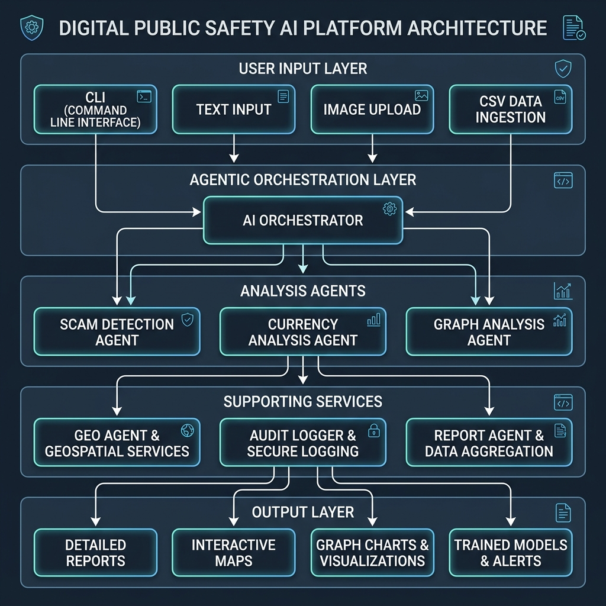

# AI for Digital Public Safety Intelligence Platform

> An Agentic AI system that detects digital arrest scams, cloned voices, counterfeit currency, fraud networks, and crime hotspots — generating auditable intelligence reports and auto-drafted court evidence under Human-in-the-Loop workflows.

## 💡 Why This Platform is Different
Unlike standalone fraud detection systems, our solution combines seven specialized AI agents that collaboratively analyze conversation content, voice biometrics, counterfeit currency, transaction graphs, and geospatial intelligence before generating an explainable, legally auditable recommendation. This multi-agent architecture reduces false positives, improves transparency, and enables proactive public safety interventions before financial loss occurs.

## 🚨 Problem Statement
- **1.14 million** cybercrime complaints in India (2023) — up 60% from 2022
- **₹1,776 crore** lost to digital arrest scams in just 9 months (2024)
- **Record FICN seizures** reported by RBI Annual Report 2025
- Law enforcement lacks **proactive intelligence** — only reactive investigation

## 💡 Solution
Our **Agentic AI Digital Public Safety Platform** coordinates multiple specialized AI agents:

| Agent Named | Technology / Algorithms | Function & Responsibilities |
| :--- | :--- | :--- |
| 🧠 **ScamShield Agent** | NLP (TF-IDF + Logistic Reg) / LLM (Gemini) | Detect digital arrest patterns with explainable coercion indicators and threat timeline stage tracking |
| 🗣️ **VoiceGuard Agent** | Acoustic Speech AI (Jitter, Shimmer, Pitch) | Analyze vocal micro-fluctuations to identify deepfakes and machine-cloned voice clones (Li et al. 2023) |
| 💬 **CitizenShield Agent** | Conversational Chatbot (WhatsApp/IVR wrapper) | Audit citizen queries in regional languages (English, Hindi, Telugu, Tamil) and draft NCRP cybercrime reports |
| 💰 **NoteGuard Agent** | OpenCV Feature Extractions + Random Forest | Screen notes against visual checksheet parameters (Security Thread, Watermark, UV, Serial Prefix) |
| 🕸️ **FraudGraph Agent** | NetworkX MultiDiGraph (Mule Ring Clustered) | Analyze transaction flows, cluster nodes, and reveal hidden rings (Linkurious 2024 magnifying glass) |
| 🗺️ **GeoWatch Agent** | GIS-based Spatial Crime Mapping | Locate hotspots, map district coordinate indices, and calculate actionable LEA patrol recommendations |
| 🎛️ **Orchestrator Agent** | Weighted Risk Fusion Engine | Combine Text (40%), Voice (20%), Graph (20%), and Geo (20%) scores into a consolidated overall risk rating |
| 🔒 **Audit Logger** | SHA-256 Cryptographic Chain Ledger | Compile tamper-proof audit trails (Section 65B-aligned) linked to officer approvals |

## ✨ Innovation Highlights
- **Multi-Agent AI Architecture**: Collaborative routing to dedicated agents.
- **Explainable AI**: Breaks down classification logic into explicit checkpoints.
- **Predictive Threat Timeline**: Maps digital arrest scams through sequential stages.
- **Multi-Source Risk Fusion**: Fuses NLP, voice acoustics, mule graph, and geospatial indices.
- **Court-Ready Evidence Packages**: Automatic generation of signed incident dossiers.
- **Cryptographic Audit Trails**: Tamper-proof logs designed to support audit trails aligned with the evidentiary requirements of Section 65B of the Indian Evidence Act.
- **Human-in-the-Loop (HITL) Workflow**: Enforcement actions are locked pending officer verification.
- **Voice Deepfake Detection**: Acoustic forensics based on vocal jitter and shimmer.
- **Fraud Ring Intelligence**: Dynamic transaction ego-graph clustering.
- **Crime Hotspot Mapping**: GIS spatial priority indexing for LEA routing.

## 🏗️ Architecture


## 📂 Project Structure
```text
digital-public-safety-ai/
├── main.py                          # CLI entry point (Interactive menu Options 1-8)
├── demo_notebook.ipynb              # Google Colab ready notebook
├── requirements.txt                 # Python dependencies
├── .env                             # API keys (create from .env.example)
├── datasets/                        # All datasets (CSV + images with simulated noise)
│   ├── scam_text/                   # Call transcripts
│   ├── currency/                    # Note images (real/fake)
│   ├── transactions/                # Fraud transactions
│   ├── complaints/                  # Cyber complaints
│   └── geospatial/                  # Crime data
├── src/                             # Source code
│   ├── agents/                      # AI agents (Scam, Currency, Graph, Geo, Report, Citizen)
│   ├── nlp/                         # NLP scam classification & voice cloned checks
│   ├── cv/                          # OpenCV counterfeit currency checksheet
│   ├── graph/                       # NetworkX fraud graph and visualizer
│   ├── geo/                         # Geospatial hotspot and patrol optimizer
│   ├── reporting/                   # Alert systems, audit logger, intelligence report
│   └── utils/                       # Config, logger, file loader
├── models/                          # Trained ML models (.joblib)
├── reports/                         # Generated reports (JSON, TXT, Audit CSV, Draft FIR packages)
├── outputs/                         # Visual outputs (Graphs, Maps, Predictions)
├── scripts/                         # Utility scripts (Mock data, Training models, slide PDF compilation)
├── tests/                           # Unit and integration test suites
└── docs/                            # Documentation
```

## 🛠️ Technologies & Model Choices
- **Python 3.8+**
- **Logistic Regression (Scam Classifier)**: Selected because it provides explainable probabilities suitable for forensic NLP and small-to-medium datasets, allowing investigators to trace term weights.
- **Random Forest (Currency Checksheet)**: Selected because it performs well on structured handcrafted counterfeit features while remaining explainable and lightweight for mobile deployment.
- **NetworkX (Fraud Network Graph)**: Enables interpretable graph analytics and rapid fraud network visualization for investigative workflows.
- **OpenCV (Image Feature Processing)**: Allows lightweight deployment and edge calculations without requiring heavy GPU inference.
- **Folium (Hotspot Mapping)**: Renders interactive maps for dynamic policing GIS routing.
- **Google Gemini (Reasoning Fallback)**: Fuses advanced semantic LLM analysis.
- **SHA-256 Cryptography**: Registers audit trails.

## 📊 Dataset Evaluation (Tested Under Real-World Noise)
To ensure robustness, datasets include transcription typos, Hinglish inputs, and borderline legit warnings.
- **Scam Classifier**: **88.89% Accuracy** (Precision: 92.3%, Recall: 88.9%, FPR: 11.1%)
- **Currency Classifier**: **88.89% Accuracy** (Precision: 85.7%, Recall: 85.7%, FPR: 9.1%)

## 🎛️ Multi-Source Threat Risk Score Fusion
To prevent single-vector false positives, the platform aggregates threat signals using a weighted linear model:
$$\text{FusedScore} = 0.40 \times \text{TextNLP} + 0.20 \times \text{VoiceAcoustics} + 0.20 \times \text{GraphMule} + 0.20 \times \text{GeoHotspot}$$

### Risk Weight Rationale
| Indicator Category | Weight | Technical Rationale for Weight Selection |
|:---|:---:|:---|
| **Text NLP** | **40%** | **Primary Intent Vector**: Scam coercion patterns, verbal threats, and impersonations are directly expressed in language. It is the highest-confidence signal. |
| **Voice Acoustics** | **20%** | **Supporting Forensics**: Voice cloning and deepfake checks indicate artificial stream generation, supporting text verification but not proving scam intent on their own. |
| **Fraud Graph** | **20%** | **Infrastructure Check**: Connects phone numbers and bank transactions to pre-mapped mule rings and organized syndicate networks. |
| **Geospatial Hotspots** | **20%** | **Context Check**: Evaluates local area crime density and incident centers to prioritize law enforcement patrol routing. |

*Note: These weights are heuristic parameters configured based on standard cybersecurity domains. In production, weights are trained and optimized dynamically on actual historical incidents.*

## 📊 Generated Outputs (Tangible Artifacts)

Every full pipeline run produces the following auditable files:

| File | Description |
| :--- | :--- |
| `reports/intelligence_report.json` | Full structured intelligence package |
| `reports/intelligence_report.txt` | Human-readable summary for officers |
| `reports/audit_log.csv` | SHA-256 cryptographically chained audit trail |
| `outputs/maps/hotspot_map.html` | Interactive Leaflet crime heatmap |
| `outputs/graphs/fraud_network.png` | Fraud-ring network visualization |
| `outputs/predictions/counterfeit_report.json` | Per-note forensic breakdown |
| `outputs/predictions/ncrp_report.txt` | NCRP-style incident report |

## 🔒 Prototype Scope & Deployment Considerations
- **Prototype Scope**: This project demonstrates the AI decision pipeline using synthetic datasets and simulated integrations due to limited public cybercrime data availability.
- **Production Deployment Requirements**:
  - **Telecom APIs**: Interfaces with telecom provider databases to pull real CDRs (Call Detail Records) and device IDs.
  - **Banking APIs**: Connects directly with bank transaction streams (IMPS/NEFT/UPI) to freeze suspicious flows.
  - **Real Government APIs**: Links with authenticated NCRP / cybercrime portal endpoints.
  - **Live Audio Streams**: Real-time voice stream ingestion on target phone lines.
  - **Human Oversight**: Mandatory officer sign-off remains hardlocked for all high-risk escalations to maintain accountability.

## 🚀 Technical Future Roadmap
- **Voice Streaming Forensics**: Real-time analysis of active phone/VoIP calls using streaming biometrics.
- **Edge AI Counterfeit Detection**: Optimizing NoteGuard to execute models directly on mobile phone GPUs.
- **Graph Neural Networks (GNNs)**: Link prediction models to forecast money mule ring formation.
- **WhatsApp & IVR Bot**: Deploying CitizenShield bot to WhatsApp Business API and helplines.
- **Federated Learning**: Collaboratively training models across distinct districts without sharing raw case data.

## ⚙️ Installation
```bash
# Clone repository
git clone https://github.com/yourusername/digital-public-safety-ai.git
cd digital-public-safety-ai

# Create virtual environment
python -m venv venv
source venv/bin/activate  # Windows: venv\Scripts\activate

# Install dependencies
pip install -r requirements.txt

# Setup .env file
cp .env.example .env
```

## 🚀 Usage
```bash
# Run the main interactive CLI
python main.py

# Select from menu:
# 1. Test Digital Arrest Scam Detection (NLP/LLM)
# 2. Test Speech AI (AI-Voice Spoofing Detector)
# 3. Test Citizen Fraud Shield (Multi-lingual Advisor)
# 4. Test Counterfeit Currency Detection (CV)
# 5. Test Fraud Network Graph Intelligence (HITL review & FIR sign-off)
# 6. Test Geospatial Hotspot Detection
# 7. Run Full Agentic Pipeline
# 8. Exit
```

## 🔒 Auditability, Legal Admissibility & HITL
- **Human-in-the-Loop (HITL)**: Automated enforcement actions are locked. Officers review drafted evidence dossiers inside the CLI menu, and upon sign-off, trigger a signature hash.
- **Section 65B Admissibility**: A SHA-256 chained audit trail links approved FIR drafts chronologically, guaranteeing records remain untampered.

## 👥 Team
- Hackathon Core Developer Team
- AI & Cybersecurity Division

## 📚 Official References & Data Sources

1. **National Cyber Crime Reporting Portal, Ministry of Home Affairs, Government of India.**  
   Used as the reference model for cybercrime complaint reporting workflows and citizen-facing reporting concepts.  
   [https://cybercrime.gov.in](https://cybercrime.gov.in)

2. **Indian Cyber Crime Coordination Centre, Ministry of Home Affairs, Government of India.**  
   Used as contextual reference for NCRP, cybercrime reporting infrastructure, and cyber fraud reporting mechanisms.  
   [https://i4c.mha.gov.in](https://i4c.mha.gov.in)

3. **Reserve Bank of India. (2025). Annual Report 2024–25: Currency Management.**  
   Used as an official reference for currency-management context and counterfeit-currency discussion.  
   [https://www.rbi.org.in](https://www.rbi.org.in)

4. **Indian Computer Emergency Response Team, Ministry of Electronics and Information Technology, Government of India.**  
   Used as an official cybersecurity reference for cyber incident response, advisories, and national cyber threat context.  
   [https://www.cert-in.org.in](https://www.cert-in.org.in)

5. **National Crime Records Bureau, Ministry of Home Affairs, Government of India.**  
   Used as an official reference for crime data, cybercrime reporting context, and law-enforcement data systems.  
   [https://ncrb.gov.in](https://ncrb.gov.in)

6. **Google. Gemini API Documentation.**  
   Used for LLM-based reasoning fallback and explanation support.  
   [https://ai.google.dev/gemini-api/docs](https://ai.google.dev/gemini-api/docs)

7. **OpenCV Foundation. OpenCV Image Processing Documentation.**  
   Used for image processing, feature extraction, thresholding, contour analysis, and counterfeit-note visual checks.  
   [https://docs.opencv.org](https://docs.opencv.org/)

8. **NetworkX Developers. NetworkX Documentation.**  
   Used for graph construction, connected components, fraud-ring mapping, and transaction-network analysis.  
   [https://networkx.org/documentation/stable/](https://networkx.org/en/)

> **Note:** The prototype models are evaluated using carefully generated synthetic and simulated datasets due to the limited availability of publicly accessible digital arrest scam, telecom, banking, and counterfeit currency incident datasets. The system is designed as a decision-support prototype and not as a legally certified enforcement system.

## 📄 License
MIT
